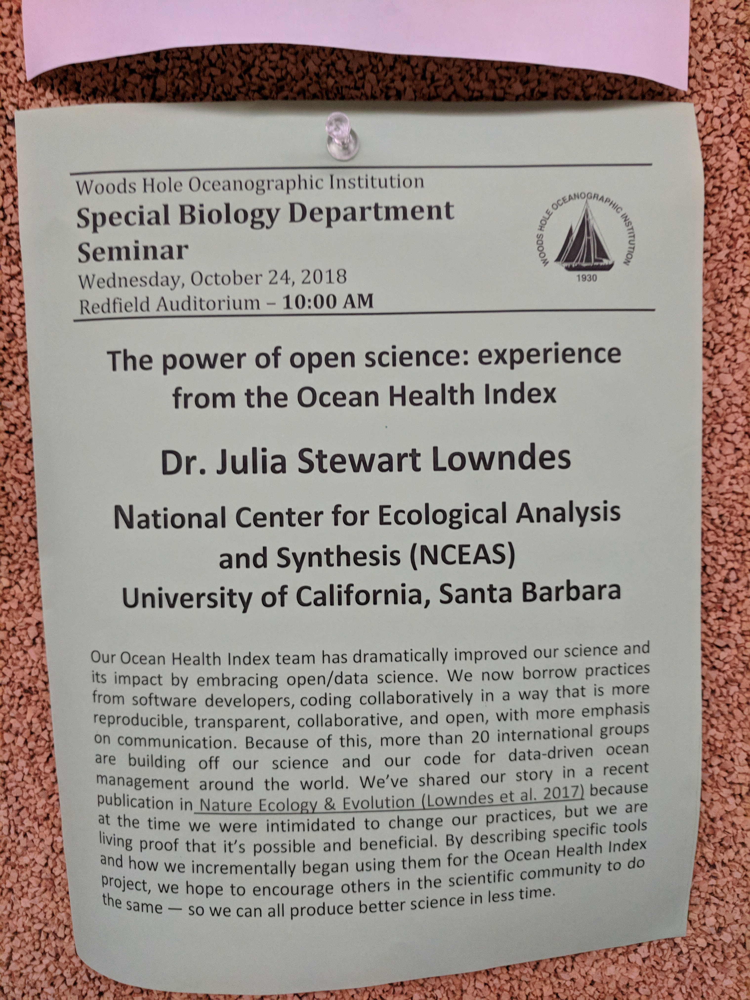

# Welcome to Software Carpentry WHOI!

All the course materials are linked from the course website: [https://jules32.github.io/2018-10-22-whoi](https://jules32.github.io/2018-10-22-whoi)

Come say hello: 
 
- Instructors: Julie Lowndes @juliesquid, Jamie Afflerbach @jafflerbach
- Host: Stace Beaulieu
- Helpers: Brett Longworth, Craig McLean

In the workshop we'll use the sticky notes to indicate whether everything is OK (blue) or not (yellow).

**If you've successfully installed everything listed in the course website setup instructions, please put a blue sticky note up on your laptop.** And put up yellow if you need help. Today we'll just be using R and RStudio, so if you need help with the others we can have a look during a break.

[Google Doc Link](https://docs.google.com/document/d/1pEoTnqanxTFWqIzBYuK4ltIXVC1B4GWZLV5EUloiFxQ/edit?usp=sharing)

WIFI info is written on whiteboard.

Toilets are just behind you.

Wednesday seminar at 10am: 

